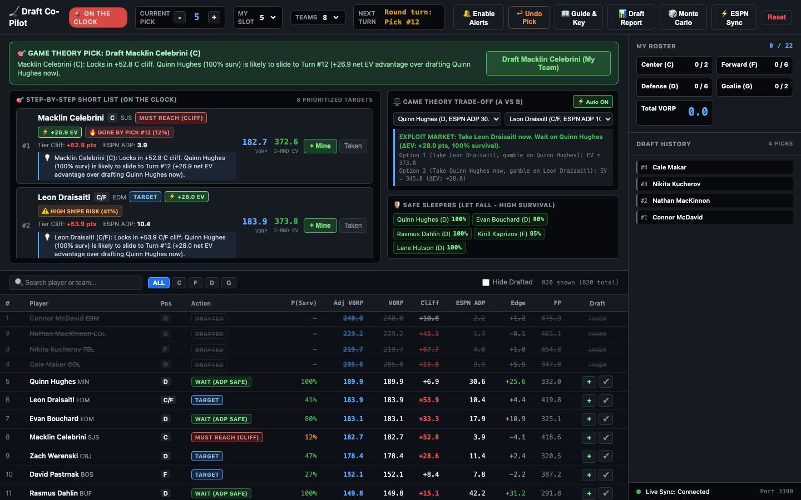
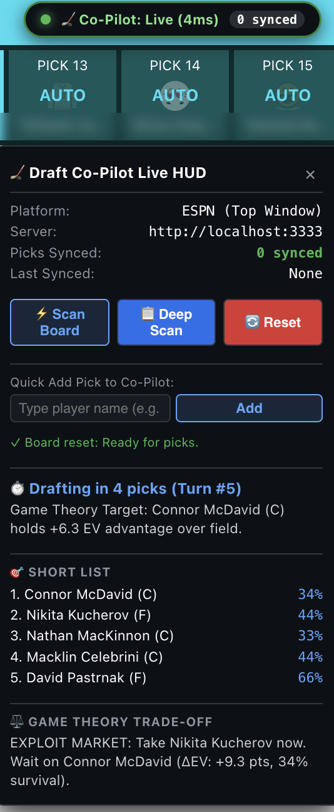

# Fantasy Hockey Draft Game Theory Co-Pilot

A live drafting co-pilot for fantasy hockey. It pairs aggregate player projections (DtZ, DFO, Apples & Ginos, The Athletic) with real-time game theory: on every pick it tells you who to take, who you can safely let slide, and why.

Built and tested for an 8-team ESPN league (**C2 · F6 · D6 · UTIL1 · G2 · BN5**, 22 rounds), but the roster limits are read from `draft_data.json`, so other league shapes are a config change away. A Chrome extension can stream picks from the ESPN or Yahoo draft room so you never type a pick by hand.



## How it helps

- **Short list on the clock**: ranked targets with survival odds (will he still be there at my next turn?), VORP, 2-round expected value, and a one-line reason.
- **Trade-off comparator**: "take the center now and gamble on the defenseman, or the reverse?" with the expected-value edge spelled out.
- **Safe sleepers**: players likely to slide, so you can let them go.
- **Live roster and history**: slot counts, total VORP, and every pick so far.
- **Post-draft report and Monte Carlo**: graded surplus value, plus simulated survival odds.

## Quick Start

Requires [Node.js](https://nodejs.org) 18+.

```bash
git clone https://github.com/mkny13/hockey-draft-copilot.git
cd hockey-draft-copilot
./start.sh          # installs deps, runs quick tests, starts the server, opens the browser
```

Or manually: `npm install && npm start`, then open <http://localhost:3333>.

### Using it in a draft

1. Set **My Slot** (your draft position) and **Teams** in the header. The default slot of 5 is a placeholder.
2. Open your ESPN or Yahoo draft room and connect it (below), or enter picks by hand with the **+ Mine** / **Taken** buttons.
3. When the banner says **ON THE CLOCK**, read the headline and short list. **Undo Pick** and **Reset** fix mistakes.

### Connect the draft room (Chrome extension)

1. Go to `chrome://extensions` and enable **Developer mode**.
2. Click **Load unpacked** and select this repo's `yahoo-sync/` folder.
3. Open the draft room. A green **Co-Pilot: Live** badge appears top-right; click it for the in-room HUD with the same short list and verdict.



After pulling new code, click **Reload** on the extension and refresh the draft tab. A bookmarklet (`yahoo-sync/bookmarklet.js`, also generated in the app's ESPN Sync dialog) and a Tampermonkey script are alternatives. The server must be running on `localhost:3333`.

**Data note:** the bundled `draft_data.json` is a **sample board**: real names, teams, positions and ESPN ADP, but synthetic FP/VORP/tier values, so recommendations are illustrative. To get real recommendations, save your own board export (same format, including `config.league.slots`) as `draft_data.local.json` in the repo root. It is gitignored and the server prefers it over the sample. ESPN ADP is refreshable with `node scripts/ingest_espn_adp.js <saved-hashtag-hockey.html>`.

---

# For developers

## Features and Engine

### 1. Automated Game Theory Decision Engine (EVONA)
- **Closed-Form 2-Round Expected Value ($\Delta EV$)**:
  Calculates the expected point gain of drafting any target $B$ compared to the board's top VORP anchor $A$:
  $$\Delta EV(B \text{ over } A) = (1 - S(B)) \cdot \text{Cliff}(B) - (1 - S(A)) \cdot \text{Cliff}(A) - [VORP(A) - VORP(B)]$$
  - Measures the **Expected Cliff Loss** saved by drafting $B$ immediately versus letting them slide to your next snake turn ($T_{next}$).
  - Automatically identifies whether taking an urgent cliff target (e.g. Leon Draisaitl at Pick 5) yields higher net portfolio value than taking a high-survival anchor (e.g. Quinn Hughes at 65% survival).
- **Survival-weighted fallbacks**: every comparison asks "what do I get if I miss him?" The fallback is the survival-weighted expected best remaining player at that position, never the other side of the matchup (two centers are not each other's fallback), and never assumed to survive when he won't.
- **Strict shortlist ordering**: decisive 2-round edge first, then composite score (EV2 + expected cliff loss), then VORP, then name. "Safe" (high-survival) players stay off the list unless one is worth more than every urgent option, so a team cannot defer its goalies forever.
- **Automated Trade-Off Advice on Every Shortlist Card**:
  - Displays **`⚡ +X.X EV Edge`** for game-theory winners and **`🛡️ SAFE TO WAIT`** for safe anchors.
  - Renders **2-Round Expected Value (`2-Rnd EV`)** alongside single-round `VORP`.
  - Includes a crisp, 1-line plain-English strategic reason (e.g. *"Locks in +53.9 C/F cliff. Quinn Hughes (65% surv) is likely to slide to Turn #12 (+41.4 net EV advantage over drafting Quinn Hughes now)."*).
- **Live Direction Banner**:
  - Automatically switches headline to **`🎯 GAME THEORY PICK`** whenever multi-round EV diverges from raw single-round VORP.
- **Auto-Populated Comparator with `⚡ Auto ON`**:
  - Automatically loads and analyzes the primary dilemma on the board by default with zero manual clicks required.
  - Toggle button allows drafters to switch between automatic dilemma tracking and custom manual pairings.

### 2. Post-Draft Report, Monte Carlo & Alerts
- **📊 Draft Report** (`GET /api/report`): graded surplus-value recap and positional balance of the finished draft.
- **🎲 Monte Carlo**: round-by-round survival odds for chosen targets from simulated drafts.
- **Alerts**: optional audio chime and desktop notification when you are ON THE CLOCK or a critical cliff appears (header **Enable Alerts** button).

### 3. League Roster & Multi-Position Rules
- **Center (`C`) & Forward (`F`) League Mapping**:
  - Skaters are mapped to Center (`C`) and Forward (`F`) positions (all LW, RW, and W players map to `F`).
  - Dual-eligible players (`C, F`) receive multi-position optionality and are never penalized if either starting slot is open.
- **Roster limits** come from the league config: starters `C2 F6 D6 G2`, plus a shared flex pool of `UTIL 1 + BN 5`. Pure centers spill into `F` once `C` is full.
- **Diminishing returns** ($\text{Adj\_VORP} = \text{VORP} \times m$, never applied to negative VORP):
  - Open starter slot at any eligible position: **100%**
  - Overflow into the `UTIL` slot (one skater; goalies cannot use it): **100%**
  - Overflow into bench (`BENCH_VALUE`): **30%**. Bench players never score; they are injury cover
  - Beyond the whole roster: **35%**
  - Leagues with no flex info fall back to the older graded curve: 85% / 65% / 35% by overflow count.
- **Must-fill starters**: once remaining picks equal the number of unfilled starter slots, only players who fill an open starter slot are worth anything (multiplier 5% for the rest). This is the safety net that guarantees a full lineup.

### 4. Packaged Hands-Free Live Draft Room Sync (ESPN & Yahoo MV3)
Located in [`yahoo-sync/`](yahoo-sync/):
- **ESPN & Yahoo Compatibility**:
  - Automatically matches and observes ESPN Fantasy Hockey draft rooms (`https://fantasy.espn.com/hockey/draft*`) as well as Yahoo draft rooms.
  - Reads ESPN pick toasts (`Name / TEAM, POS` + `R#, P#`), the draft board, and history feeds. A toast is recognised only as the **innermost small element** holding both the player and the round/pick marker, and anything inside the Available Players table is ignored, so the top available player can never be recorded as a pick.
  - The extension sends the round and pick number with each pick. **Ownership is decided by the server from the snake schedule and your slot**, not from page CSS; the page's own "mine" flag is ignored because it proved unreliable. The app's own **+ Mine** / **Taken** buttons are the one manual override.
- **Background Health Service Worker (`background.js`)**:
  - Runs periodic 5-second health checks against `http://localhost:3333/api/state`.
  - Measures latency and broadcasts status updates to the popup and open ESPN/Yahoo Draft tabs.
- **Extension Options Popup (`popup.html` / `popup.js`)**:
  - Displays live server status (`● Connected` with millisecond latency or `● Disconnected / Offline`).
  - Persists configurable server URL in `chrome.storage.local` with on-demand ping verification.
- **In-Room Live Connection Badge (`status.css` / `content.js`)**:
  - Injects a high-contrast badge pinned to the top-right corner of the ESPN / Yahoo draft room DOM (`#copilot-yahoo-badge`).
  - Green glowing dot indicates live synchronization; tracks synced pick counts.
  - Watches draft table rows with a `MutationObserver` and streaming fallback to push picks hands-free to `/api/pick`.
- **Live-verified on ESPN** (practice draft, 8 teams, slot 5): all 176 picks synced contiguously with no duplicates; the 22 picks marked mine sat exactly on the snake numbers; ESPN's own roster matched. ESPN renders each pick as `Name / TEAM POS` + `R#, P# - Team` in the right-hand Picks feed, which is what the scanner reads. ESPN's pick clock is ~30s and auto-enables Autopick when it lapses, so drive your own picks quickly (or queue them).
- **Live HUD (click the badge)**: connection status, pick counts, scan/reset controls, quick-add, and the decision panel: current headline and subtext, the top-5 short list with survival odds, and the game-theory trade-off verdict. On ESPN it docks over the Picks sidebar (`espn-layout`, right-aligned, 276px wide). The server attaches an `evaluation` snapshot to every WebSocket broadcast.
- **Server-side pick handling**: names are canonicalised to the board's spelling (accents/case/punctuation), positions and team are filled from the board, duplicates are rejected, and undo restores the undone pick's number.
- **Bookmarklet / Tampermonkey**: alternatives to the extension (`bookmarklet.js`, the bookmarklet generated by the app header modal, `tampermonkey.user.js`).

---

---

## Running Tests

```bash
npm test          # full suite (~25s)
npm run test:quick  # engine + data only (what ./start.sh runs before launching)
```
Plain Node `assert`, no framework. `jsdom` (dev dependency) simulates the draft-room DOM.

| File | Covers |
|---|---|
| `test/test_gametheory.js` | Normal CDF and $P_{survive}$, snake scheduling, cliff alerts, C/F rules, EVONA comparator, survival-weighted fallbacks (`findNextAlt`), UTIL / bench / must-fill logic, negative-VORP guard, strict shortlist order (input-order independent), draft-complete state, roster counting, post-draft grader, Monte Carlo |
| `test/test_data.js` | Board integrity: 820 unique players, league config, clean one-decimal ADP (guards the old corrupt-parse bug), top-200 ADP coverage, both `draft_data.json` copies identical, extension name lookup matches the board |
| `test/test_server.js` | Spawns the real server (temp state file): league limits, canonical names, snake-schedule ownership, manual override, pick numbering, undo, settings clamp, origin check, evaluation snapshot, WebSocket broadcasts, reset |
| `test/test_sync.js` | Runs the real extension content script and both bookmarklets in jsdom: wrapper-with-available-list layout (the "top available player recorded as a pick" bug), player-pool guard, marker order, dynamic toasts, retry after network failure, HUD rendering, badge state, manifest sanity |
| `test/test_mock_draft.js` | Strategy regression: the engine beats a pure-ADP drafter, fills 2 goalies and a full lineup, and drafts are deterministic |

---

## Mock Drafts & Strategy Simulation

```bash
node scripts/mock_draft.js --slot 5 --verbose        # one draft, the engine picks for slot 5
node scripts/mock_draft.js --slots 1-8 --sims 20     # Monte Carlo across draft slots
```
The Co-Pilot's recommended pick drives one team; the other seven draft from ESPN ADP with per-team noise (±7) and fill their starting slots like real teams. Each sim is also run with a noise-free pure-ADP drafter at the same slot, so the lineup-points difference isolates what the engine adds. Results on the bundled sample board (12 sims per slot): the engine averages a 1.0-1.3 finish in every slot and beats the ADP drafter by roughly +200 to +450 lineup points. Caveat: the opponents' ±7 noise matches the engine's own survival model, and the sample board's values are derived from ADP, so real drafters and real projections will behave differently.

---

## Architecture & Code Map

- `server.js`: Node.js Express & WebSocket server (`PORT=3333`). Manages live draft state (`draft_state.json`), CORS-enabled `/api/pick`, `/api/undo`, `/api/reset`, `/api/settings`, `/api/state`, `/api/evaluation`, `/api/report`, and live WS broadcast (with an `evaluation` snapshot for the HUD). League roster limits are derived from `draft_data.json` on every load.
- `public/js/gametheory.js`: Mathematical game-theory engine (isomorphic): survival odds ($P_{survive}$), snake schedule, roster counting and flex/must-fill logic, diminishing returns, target trade-offs (`computeTargetTradeoffs`), top matchup (`getTopMatchup`), 2-round EVONA comparator (`comparePlayersGameTheory`, `findNextAlt`), post-draft grader, and Monte Carlo.
- `public/js/app.js`: Client-side UI controller, search, reactive table rendering, shortlisted cards with trade-off callouts, auto-comparator handler, and WebSocket receiver.
- `public/css/style.css`: High-contrast dark theme optimized for drafting under time pressure.
- `draft_data.json` (mirrored in `public/`, kept identical by `test_data.js`): the 820-player board with league config, C/F eligibility, and ESPN ADP. The committed file is a synthetic sample; a real deployment adds its own export as the gitignored `draft_data.local.json`, which the server prefers. Do not recompute VORP from raw source data; only the ADP columns are regenerated by the ingest script.
- `scripts/ingest_espn_adp.js`: merges ESPN ADP from Hashtag Hockey only. Values must be plain numbers with at most one decimal; Daily Faceoff's text has columns glued together and produced corrupt values, so it is no longer used.
- `scripts/mock_draft.js`: seeded mock-draft / Monte Carlo simulator (see above).
- `docs/screenshots/`: images used by this README.
- `yahoo-sync/`: Complete Manifest V3 extension, bookmarklet, and Tampermonkey script for `fantasy.espn.com` and `draft.fantasysports.yahoo.com`.

---

## Credits and data sources

This is a personal project. It was built on top of an export from a fantasy hockey values aggregator that blends projections from DtZ, Daily Faceoff, Apples & Ginos and The Athletic, plus ESPN ADP from Hashtag Hockey. Thanks to the aggregator's developer and to those projection authors; the game-theory layer here would have nothing to work with without their valuations.

This repo does not include or redistribute their projections. The bundled `draft_data.json` is a sample with synthetic values (see [Data note](#connect-the-draft-room-chrome-extension)). To use the Co-Pilot for a real draft you will need to adapt it to your own league and valuations:

- set your league's roster slots and team count in `config.league` of your board file;
- supply your own board (FP, VORP, positions, ADP) as `draft_data.local.json`, built from whatever rankings or projections you trust and are licensed to use;
- set your draft slot in the app.

The Co-Pilot's tuning (survival model, diminishing returns, mock-draft results) was developed against one 8-team ESPN league, so expect to re-check it for yours.

## License

[MIT](LICENSE)
